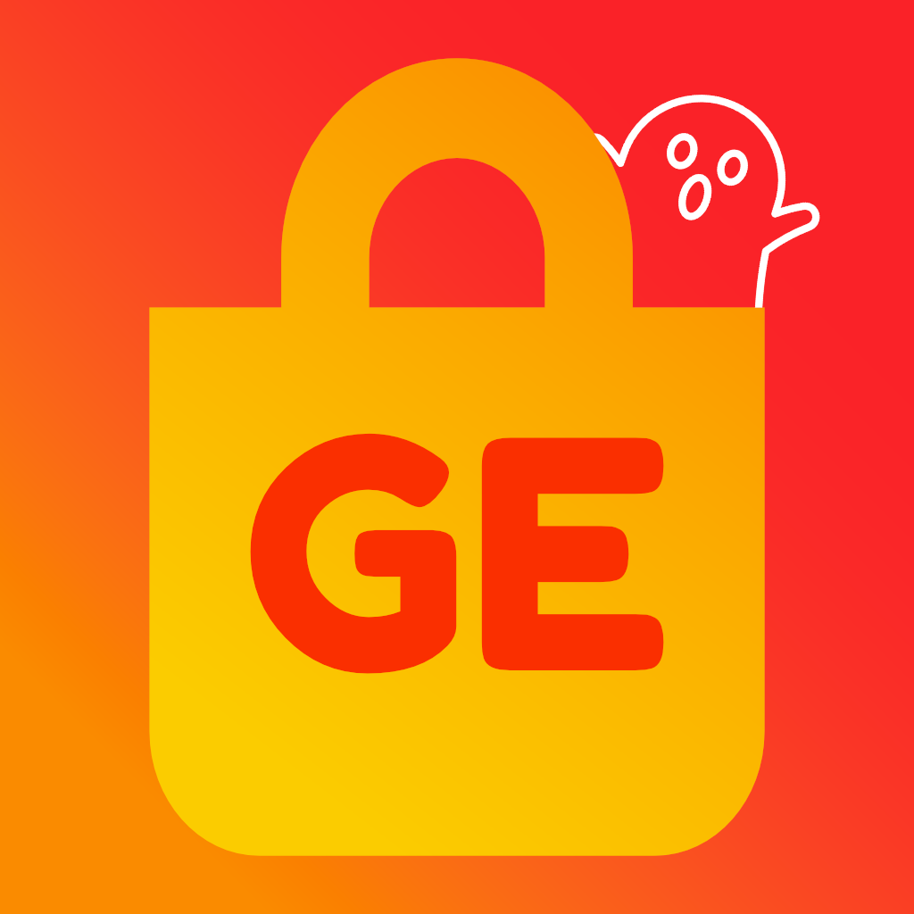

<p align="center"></p>

<h1 align="center">Ghost eShop Desktop</h1>


<h3 align="center">Stay alive !</h3>
<a align="center" href="https://ghosteshop.com/" target="_blank"><p align="center">Go to website</p></a>


## Download

You can download from the [GitHub Releases](https://github.com/ghost-land/ge-desktop/releases). If there is no build for your platform, build with the dev kit

## Use it

To use it, select a game, scan the qr with FBI's remote installer

## Developement

**What do you need ?**

* Node.js v12
* Dependences with ```npm install```

---

**Clone and installation of dependences**

```console
> git clone https://github.com/ghost-land/ge-desktop.git
> cd NumWorks-Emulator
> npm install
```

---

**Start the app**

```console
> npm start
```

---

**Build the app**

Build for your platform

```console
> npm run dist
```

| Platform    | Command              |
| ----------- | -------------------- |
| Windows x64 | `npm run dist:win`   |
| macOS       | `npm run dist:mac`   |
| Linux x64   | `npm run dist:linux` |

[](https://discord.gg/9Rqvh9F)

<a href="https://github.com/Ghost0159" style="padding-left: 5px; padding-right: 5px;"></a>
<a href="https://github.com/Ghost0159" style="padding-left: 5px; padding-right: 5px;"></a>
